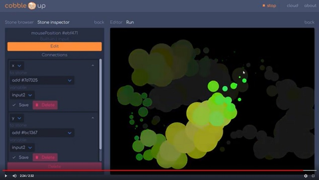

# cobble

Visual creative coding in the browser!


## Try it out
[www.cobbleup.org](https://www.cobbleup.org)

## Quick 2 min demo sketch
[](https://youtu.be/oILrJw5bNsY)


[view on youtube](https://youtu.be/oILrJw5bNsY)

## Overview
Cobble is node editor built around P5.js.

The goal of the project is to create an easy low-threshold environment to get introduced to the field of creative coding.

Simply drag building blocks (cobblestones) from the list into the field and connect outputs to inputs. Clicking on an input connector clears the connection.

Connections can also be created or changed in the inspector on the left, after selecting a block. Clicking the orange 'edit' button in this inspector allows you to edit default values for variables. Use this for unconnected inputs that should have a constant value.

Blocks are executed from left to right order, so you probably want to put your `clearBackground` block on the left side.

Click run to start the sketch. You can save your projects in the cloud tab.

## Editable blocks
There are editable input, process and output blocks. You can edit the internal code of these blocks. The code of these editable blocks may run a little slower because it gets executed using [Neil Fraser's js-interpreter](https://neil.fraser.name/software/JS-Interpreter/docs.html), for security reasons.

A how-to on how to access the inputs and outputs and available p5 functions is coming soon (See todo list below). Feel free to [email me](mailto:info@janbijster.com) or start a github issue if you want me give this priority.

## Roadmap
Cobble is currently in an alpha version. I am rolling out incremental updates whenever I find the time. The following is on my todo list for the application:

**Features**
* Drag a buildingblock of the field to delete
* Drag a connection away to delete the connection
* Copy and paste a building block or group of connected building blocks
* Be able to select a group of blocks and turn them into group-block
* Loop block: a block with an index as output. Every block (indirectly) connected to this index is executed n times, with the index incrementing.
* Gallery with published sketches
* Proper backend for saving and loading

**Bugs**
* Saving projects in the cloud tab gives strange errors
* Connections can't be drawn graphically from blocks right to left, z-index issues (the connection will be before the block)
* Connections are recalculated every n frames now, which causes a delay and unnecessary computing power. Should be event based on position changes.

## Contact
For questions or if you want to join me in developing the project :) contact me at info@janbijster.com.

## For development
It's a Vue-cli project so use this to make it run locally, build or lint:

### Project setup
```
npm install
```

### Compiles and hot-reloads for development
```
npm run serve
```

### Compiles and minifies for production
```
npm run build
```

### Lints and fixes files
```
npm run lint
```

### Backend
For security purposes I have excluded the backend from the repository. Nothing fancy, just a simple api that stores and retreives users and projects.